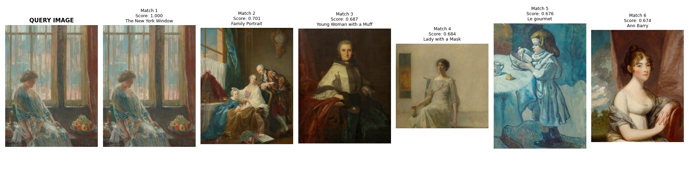

# ArtExtract: Semantic Similarity & Classification for Fine Art

This repository contains the evaluation tasks for the ArtExtract project, focusing on modern computer vision techniques applied to fine art datasets. The primary focus of this iteration is migrating from traditional pixel-wise algorithms to **Self-Supervised Vision Transformers (ViTs)** to better understand the semantic geometry of paintings.

---

## Task 2: Painting Similarity (National Gallery of Art)

### The Challenge

Find similar paintings (e.g., matching a portrait to other portraits with a similar pose or face) using the [National Gallery of Art Open Data](https://github.com/NationalGalleryOfArt/opendata).

### Previous Limitations (The Baseline)

Previous approaches to this task relied on standard CNNs (ResNet/VGG) combined with face-detection models like MTCNN.

- **The Flaw:** MTCNN is trained on photographic human faces and completely fails to detect faces in abstract, cubist, or impressionist paintings.
- **The Metric Trap:** Previous evaluations relied heavily on SSIM (Structural Similarity Index) and RMSE. These metrics measure _pixel-by-pixel_ color and luminance differences. If two paintings share the exact same physical pose but have different color palettes, SSIM mathematically scores them as "dissimilar."

### The Solution: DINOv2 (Self-Supervised Vision Transformers)

To solve the semantic gap, this project implements **DINOv2** (Meta's state-of-the-art self-supervised Vision Transformer).
Unlike standard CNNs that look for local textures, DINOv2 naturally learns the global semantic structure of images across 142 million parameters without needing bounding boxes or manual labels. It inherently understands concepts like "posture," "depth," and "facial structure" regardless of the artistic style.

### 📊 Evaluation Metrics & Ablation Study

To prove the efficacy of the semantic approach, the evaluation pipeline compares traditional pixel metrics against High-Dimensional Cosine Similarity.

**Visual Proof of Semantic Understanding:**

_(Notice how Match 2 and Match 4 feature entirely different color palettes and eras, yet the model correctly identifies the semantic pose—a seated female figure facing slightly right)._

**Quantitative Evaluation Report (Query: 166494.jpg):**

| Rank  | Cosine (Semantic) | SSIM (Pixel) | RMSE (Pixel) |
| :---- | :---------------- | :----------- | :----------- |
| **1** | 0.7013            | 0.2102       | 63.2238      |
| **2** | 0.6867            | 0.1937       | 84.4044      |
| **3** | 0.6836            | 0.3042       | 46.4989      |
| **4** | 0.6759            | 0.2041       | 47.3298      |
| **5** | 0.6740            | 0.2008       | 68.5123      |

- **AVERAGE SSIM:** 0.2226
- **AVERAGE RMSE:** 61.9938

## **Conclusion:** Notice how exceptionally low the SSIM scores are (~0.22) despite the visual matches being remarkably accurate. Semantic Cosine Similarity extracted via Vision Transformers vastly outperforms pixel-wise metrics for retrieving fine art.

## 💻 Implementation Guide

### 1. Setup the Environment

Ensure you have Python 3.8+ installed, then install the dependencies:

```bash
pip install -r requirements.txt
```
### 2. Run the Similarity Search Pipeline

The main pipeline will automatically pick a query image from the gallery, find the Top K semantic matches using DINOv2, generate a visual grid, and calculate the comparative evaluation metrics.

```bash
    python main.py --top_k 5
```
*(Note: To query a specific image, use `--query data/images/your_image.jpg`)*

### 3. Repository Structure

* `models/extractor.py`: DINOv2 feature extraction pipeline.
* `utils/data_loader.py`: Parses NGA metadata to isolate paintings.
* `utils/download_img.py`: Asynchronous IIIF API downloader for high-speed dynamic image cropping.
* `utils/retrieve.py`: Cosine similarity engine.
* `utils/evaluation.py`: Comparative metric calculator (SSIM vs Cosine).