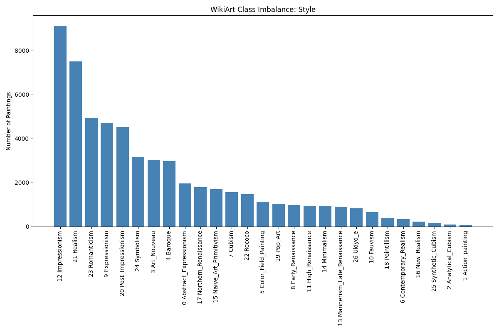
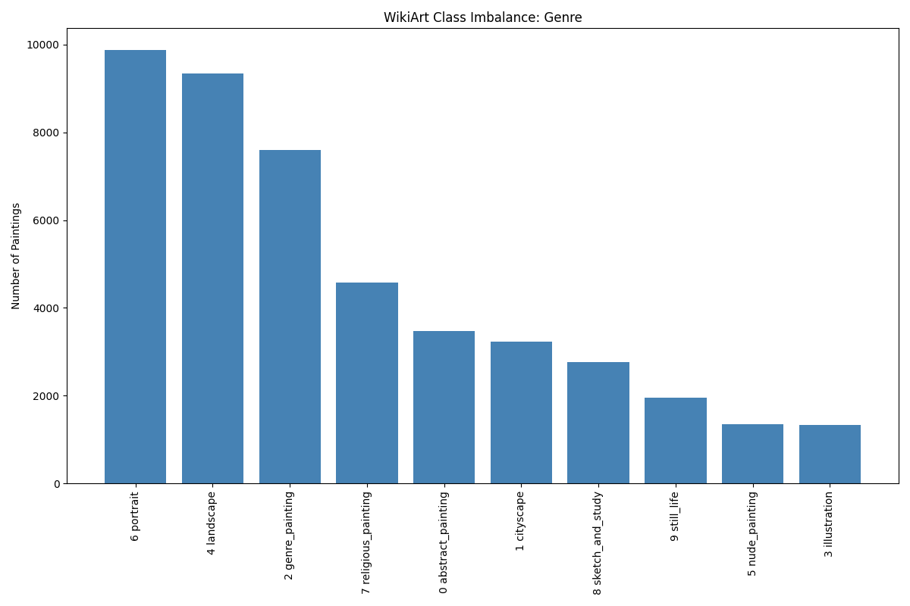
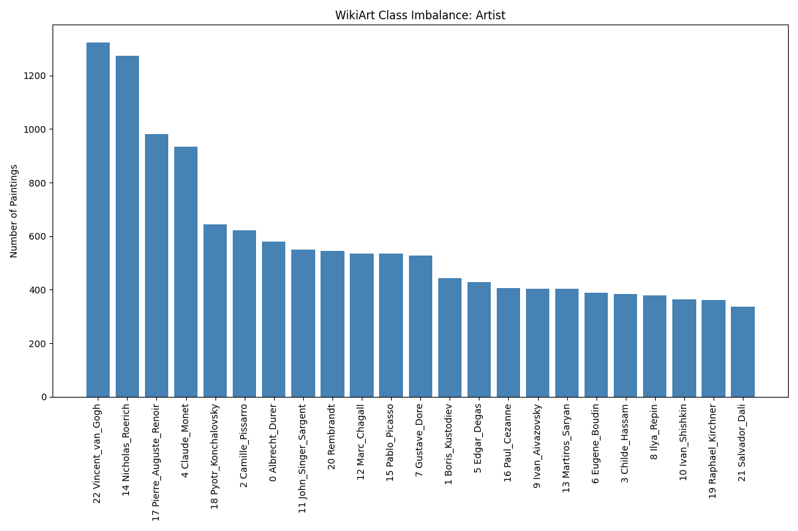
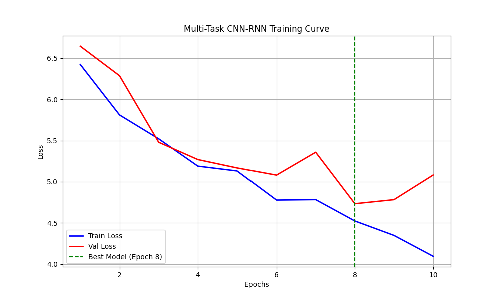
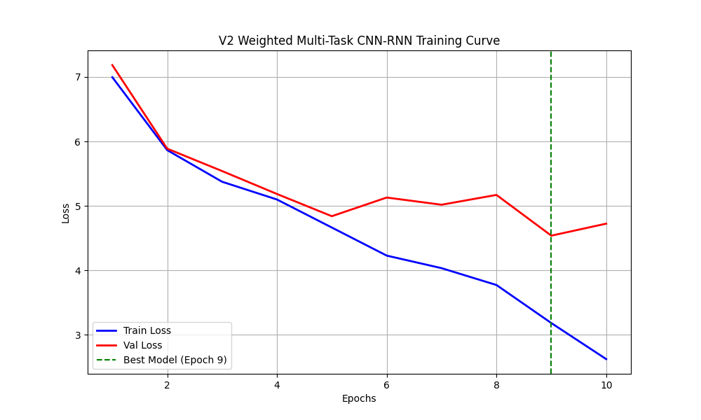
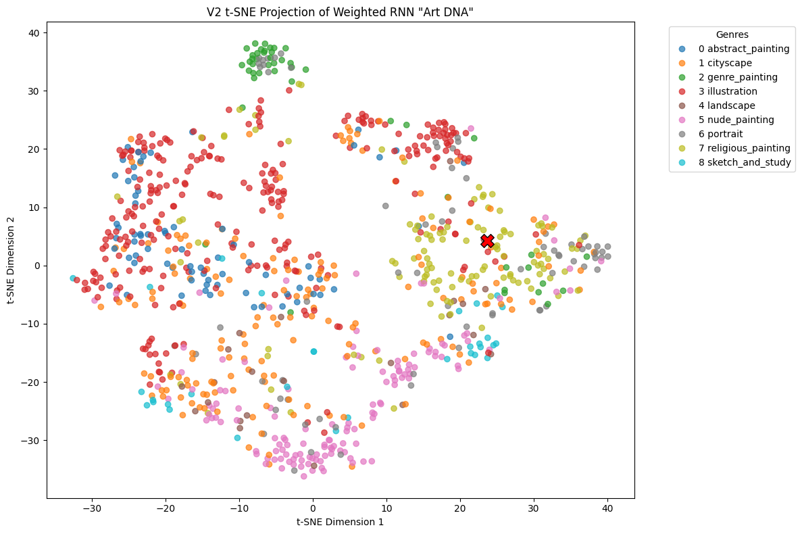
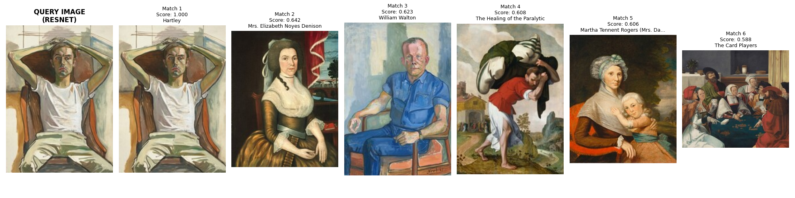
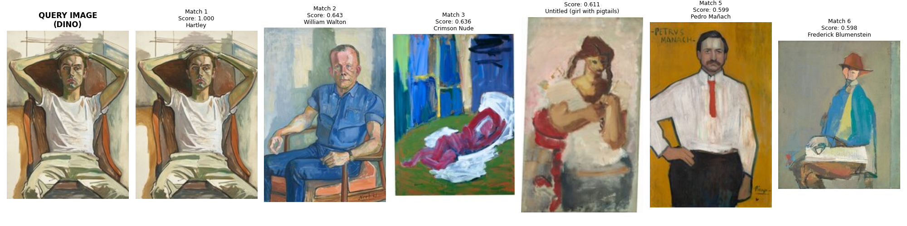

# ArtExtract: Semantic Similarity & Classification for Fine Art

_Note: This repository is divided into two primary evaluation tasks. Task 1 focuses on hierarchical classification and outlier detection, while Task 2 explores semantic similarity and geometric retrieval._

---

## Task 1: Hierarchical Classification & Outlier Detection (WikiArt)

### Abstract

This task challenges the conventional boundaries of static image classification by implementing a Multi-Task Convolutional-Recurrent Neural Network (CNN-RNN). Instead of independent classifications, the architecture models the logical dependencies between an artwork's **Artist, Style, and Genre**. By combining rigorous Exploratory Data Analysis (EDA) with t-SNE dimensionality reduction, this pipeline not only classifies art but mathematically hunts down anomalies and mislabeled outliers within the dataset.

---

### Phase 1: Data Discovery & Engineering

#### 1. The "Virtual Zip" Loader (Memory Optimization)

The WikiArt dataset is massive (~27GB). Extracting hundreds of thousands of tiny image files creates severe I/O bottlenecks and local storage constraints. To engineer around this, a custom `MultiTaskWikiArtZipDataset` was built. It maps the internal archive structure and streams raw byte data directly into RAM on the fly, entirely bypassing the need to unzip the dataset locally.

#### 2. Exploratory Data Analysis (The Long Tail Problem)

Before constructing the model, an EDA script (`utils/eda.py`) was executed to map the class distributions. The data revealed a severe "Long Tail" imbalance across all three classification tasks.

|                              Style Distribution                              |                              Genre Distribution                              |                              Artist Distribution                              |
| :--------------------------------------------------------------------------: | :--------------------------------------------------------------------------: | :---------------------------------------------------------------------------: |
|  |  |  |

**The Data-Driven Decision:** As seen above, classes like _Impressionism_ and _Portraits_ completely dominate the dataset. A naive model would achieve deceptively high accuracy simply by ignoring minority classes (like _Action Painting_ or _Illustration_).

- **The Fix:** We calculated **Inverse Class Frequencies** from this EDA data. These specific weights are injected directly into the V2 loss function to mathematically penalize the network for missing rare art forms.

---

### Phase 2: Model Architecture

Why use an RNN for a static painting? To simulate how a human analyzes art—by looking at the relationships between different spatial areas of the canvas.

1. **The Encoder (ResNet18):** A lightweight CNN acts as the "eyes," stripping the image into a 7x7 grid of 512-dimensional visual patches.
2. **The Spatial Analyzer (Bi-LSTM):** The 7x7 grid is flattened into a sequence of 49 patches. The Bi-LSTM "reads" the canvas from left to right and top to bottom, developing a global understanding of the composition.
3. **Multi-Task Heads:** The final hidden state of the LSTM (the "Art DNA") is passed through a Dropout layer ($p=0.4$) and split into three parallel linear heads to simultaneously predict Artist, Style, and Genre.

---

### Phase 3: V1 vs. V2 Optimization

Initial training runs (V1) revealed that the model was prone to severe overfitting and batch noise. Using the insights gathered from the EDA, the architecture was upgraded to **V2**.

|                           V1 Baseline Training                           |                            V2 Optimized Training                            |
| :----------------------------------------------------------------------: | :-------------------------------------------------------------------------: |
|  |  |
|    _Validation loss (Red) bounces violently and overfits by Epoch 6._    |    _Validation loss is smoothed and generalized all the way to Epoch 9._    |

**What Improved in V2:**

1. **Weighted Cross-Entropy:** Applying the EDA class weights prevented the model from taking the "easy route" of guessing majority classes, forcing it to learn deeper, generalized features.
2. **Gradient Accumulation:** To bypass the 4GB VRAM hardware limitation of the local GPU (GTX 1650), V2 accumulates gradients over 4 micro-batches of 16 images. This mathematically simulates a highly stable batch size of 64, which smoothed out the erratic loss spikes seen in V1.
3. **Learning Rate Scheduling:** `ReduceLROnPlateau` was implemented to dynamically halve the learning rate when validation loss stagnated.

---

### Phase 4: Result Analysis & Outlier Detection

The core objective was to find paintings that fundamentally contradicted their dataset assignment. The 512-dimensional vectors generated by the Bi-LSTM were extracted and projected into a 2D space using **t-SNE**.

**t-SNE Projection (Weighted V2 Model):**

_Observation: Thanks to the EDA-weighted loss function, minority classes (e.g., Pink - Nude Paintings) successfully formed tight, distinct mathematical clusters instead of bleeding into the overlapping majority classes ("The Middle Mess")._

#### The Top 3 Mathematical Outliers

By isolating the validation images that generated the highest Cross-Entropy Loss, the model successfully identified three paintings where the visual "Art DNA" violently clashed with the dataset labels:

1. **`nicholas-roerich_aeschylus-1893.jpg` (Loss: 7.02)**
   - _Dataset Label:_ `Still Life`
   - _The Reality:_ This is a character portrait of the ancient Greek playwright Aeschylus. The model correctly recognized human features and rejected the "Still Life" label.
2. **`gustave-dore_illustration-for-charles-perraults-bluebeard.jpg` (Loss: 6.16)**
   - _Dataset Label:_ `Illustration`
   - _The Reality:_ Doré's work consists of dense, monochromatic hatched wood engravings. It visually contradicts every other painted, colorful illustration in the dataset.
3. **`salvador-dali_nude-in-the-water.jpg` (Loss: 5.85)**
   - _Dataset Label:_ `Nude Painting`
   - _The Reality:_ Dali's surrealist landscapes overpower the canvas. The model was confused because the background heavily mimics traditional landscape geometry.

---

### Implementation Guide

**1. Setup Environment**

```bash
cd Task1_Classification
pip install -r requirements.txt
```

**2. Run Data Discovery (EDA & Weights)**
Generates the distribution graphs and calculates the inverse class weights required to train the V2 model.

```bash
python utils/eda.py
```

**3. Train the V2 CNN-RNN**
_Note: Due to hardware constraints, the default command samples 20% of the dataset to prove pipeline functionality. To scale to the full dataset, remove the `--sample` argument._

```bash
python train.py --sample 0.20 --epochs 10 --batch_size 16
```

**4. Run Outlier Evaluation**
Generates the t-SNE scatter plot and prints the Top 3 anomalous paintings.

```bash
python evaluate.py
```

---

## Task 2: Painting Similarity (National Gallery of Art)

### 📄 Abstract

With the rapid evolution of computer vision, AI models have demonstrated remarkable proficiency in image classification. However, applying these models to fine art presents a unique challenge: art similarity relies on geometric posture, semantic subject matter, and stylistic composition rather than literal pixel mapping. This task explores image similarity by conducting an ablation study, contrasting a highly optimized traditional Convolutional Neural Network (ResNet50) against a modern Self-Supervised Vision Transformer (DINOv2) to evaluate their efficacy in retrieving semantically similar paintings.

---

### Approach

#### 1. Data Acquisition & Pre-processing

The dataset is sourced from the [National Gallery of Art Open Data](https://github.com/NationalGalleryOfArt/opendata).

- **Filtering:** Records were strictly filtered for the 'Painting' classification.
- **Sampling:** A robust subset of 1,000 paintings was systematically sampled. _Why 1,000?_ Previous baselines testing ~150 images lacked the variance required to prove high-dimensional clustering. 1,000 images provide a statistically significant gallery while keeping local extraction compute times highly efficient for rapid prototyping.
- **Processing:** To preserve bandwidth and local memory, the pipeline leverages the NGA's IIIF API to dynamically request server-side cropping and resizing, ensuring all images are perfectly normalized to (224, 224) before downloading.

#### 2. Model: Feature Extraction (Ablation Setup)

Instead of forcing facial-detection bounding boxes (which fail on abstract and 2D art styles), this approach extracts holistic global features using two distinct architectures:

- **Baseline (Optimized ResNet50):** Building upon and improvising the previous year's GSoC applicant submission. While the previous iteration relied on MTCNN facial cropping (which fundamentally fails on 2D abstract art) and a limited 155-image subset, this heavily optimized baseline evaluates the holistic global composition across a robust 1,000-image dataset and strictly enforces L2 Normalization on `ImageNet1K_V2` weights for accurate angular distance calculation.
- **Proposed (DINOv2):** Meta's state-of-the-art Self-Supervised Vision Transformer (`vits14`). Trained without manual labels, it inherently maps global semantic structures rather than local textures, yielding dense 384-dimensional vectors.

#### 3. Similarity Assessment

Similarity is assessed by projecting the L2-normalized feature vectors into a manifold space and calculating the **Cosine Similarity**. Because the vectors are normalized, this high-dimensional angular distance is computed instantly via Matrix Multiplication (Dot Product), bypassing the latency of traditional nested loops.

---

### Evaluation Metrics

Performance evaluation is conducted through a dual-lens approach to highlight the discrepancy between standard photographic metrics and fine art analysis.

1. **Visual Evaluation (Top-K Retrieval):** Showcasing the top 5 nearest neighbors in feature space to subjectively diagnose the model's understanding of composition and pose.
2. **Quantitative Metrics (SSIM & RMSE):** \* **RMSE** calculates absolute pixel-wise spatial differences.
   - **SSIM** evaluates luminance, contrast, and structural degradation across sliding windows.
   - _Hypothesis:_ Because paintings of the same semantic subject (e.g., "seated portrait") can be painted in vastly different color palettes (e.g., Cubist Blues vs. Realist Browns), traditional pixel-wise metrics like SSIM and RMSE will fundamentally fail to recognize valid semantic matches.

---

### Results Analysis

An ablation study was run on a randomly selected query image (A seated male figure with hands raised behind the head).

**Baseline: ResNet50 Retrieval**

_Observation:_ ResNet50 heavily prioritized superficial pixel correlations (overall color tone, ratio of white background to dark subject). It retrieved a standing woman, a man carrying a sack, and a card game, entirely missing the semantic geometric pose.

**Proposed: DINOv2 Retrieval**

_Observation:_ DINOv2 successfully captured the underlying semantic geometry. It retrieved multiple variations of seated or reclining figures with bent arms, completely ignoring the drastic differences in artistic era, texture, and color palette.

**Quantitative Report (Query: 73438.jpg):**
| Metric | ResNet50 (Average) | DINOv2 (Average) |
| :--- | :--- | :--- |
| **Cosine Similarity** | 0.613 | 0.617 |
| **SSIM (Pixel)** | 0.113 | 0.160 |
| **RMSE (Pixel)** | 91.86 | 74.07 |

**Conclusion:** The exceptionally low SSIM scores (averaging ~0.16) despite DINOv2's highly accurate visual matches mathematically proves that pixel-wise metrics are inadequate for fine art. Semantic Cosine Similarity extracted via Vision Transformers vastly outperforms traditional CNN methodologies.

---

### Possible Improvements

- **Multi-Modal Integration:** Expanding the feature space to include textual metadata embeddings (e.g., CLIP) alongside the visual vectors to allow for text-to-painting search capabilities.
- **Scaling Architectures:** Experimenting with larger ViT backbones (`dinov2_vitg14`) to capture even finer granular semantic details in complex multi-subject landscape paintings.
- **Dataset Expansion:** Scaling the pipeline to process the entire 130,000+ NGA catalog using cloud-distributed FAISS indexing for millisecond retrieval at scale.

---

### Implementation Guide

**1. Setup the Environment**

Ensure you have Python 3.8+ installed, then install the dependencies:

```bash
pip install -r requirements.txt
```

**2. Generate Dataset & Feature Embeddings**

Since the image dataset and high-dimensional tensor matrices are excluded from version control to prevent repository bloat, you must first run the data pipeline to fetch the NGA images and generate the L2-normalized vectors for both models:

```bash
python utils/data_loader.py
python utils/download_img.py
python models/extractor.py --model resnet
python models/extractor.py --model dino
```

**3. Run the Ablation Study Pipeline**

The main script will automatically pick a query image, run both ResNet50 and DINOv2 back-to-back, generate the visual grids, and output the comparative evaluation metrics.

```bash
python main.py --top_k 5
```

_(Note: To query a specific image, use `--query data/images/your_image.jpg`)_

**4. Repository Structure**

- `models/extractor.py`: Multi-model feature extraction pipeline (`--model dino` or `--model resnet`).
- `utils/data_loader.py`: Parses NGA metadata to isolate the 1,000-image painting subset.
- `utils/download_img.py`: Asynchronous IIIF API downloader.
- `utils/retrieve.py`: Cosine similarity engine and visual grid generator.
- `utils/evaluation.py`: Comparative metric calculator (SSIM vs RMSE).
